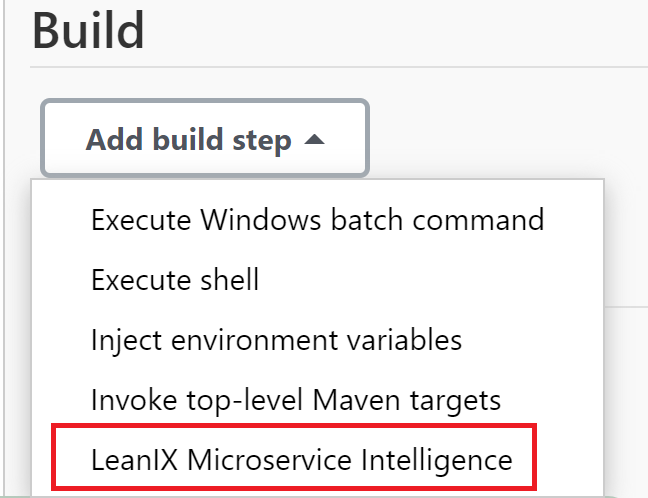
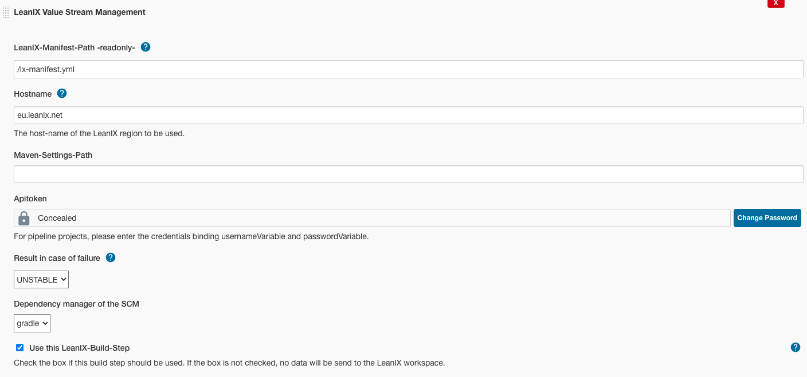

## Introduction

This plugin connects Jenkins Jobs with your LeanIX workspace. When the plugin is integrated in your Jenkins pipelines and jobs, information on your services built and deployed with Jenkins can be called up in LeaxIX factsheets .

## Prerequisites

In order to be able to use the LeanIX Microservice Intelligence Plugin, the following requirements must first be met:

* The LeanIX Microservice Intelligence plugin must be installed: https://www.jenkins.io/doc/book/managing/plugins/
* You have a valid **LeanIX API token**.
* If you are **using scripted pipelines** in which the LeanIX plugin is to be integrated as a step, the "Credentials Binding" plugin must be installed: https://plugins.jenkins.io/credentials-binding/  
  For projects such as a **Freestyle project**, in which the plugin can be added via UI as a build step, the plugin for injecting environment variables might be required instead: https://plugins.jenkins.io/envinject/
* An **SCM provider** (e.g. Git) must be configured for the pipeline to be used and the possibly necessary plug-in installed.
* The **manifest file** made available by LeanIX and filled with the appropriate values is located in the corresponding repository, so that it can be accessed by the plugin. The contents is sent by the plugin to the LeanIX interface.

## Configuration

The configuration of the LeanIX Microservice Plugin is divided into three parts:

* [Setting up secrets in the Jenkins administration](#setting-up-secrets-in-the-manage-jenkins-area),
* [Central configuration of the plugin](#central-configuration-of-the-plugin),
* [Configuration of individual pipelines and jobs in which the plugin is to be used.](#individual-configuration-of-pipelines-and-jobs)

### Setting up secrets in the Manage Jenkins area.
This section is only important if you want to use the LeanIX plugin in scripted pipelines. For this purpose, a new credentials record with the following parameters is created in Jenkins in the "Manage Jenkins" -> "Security" -> "Manage Credentials" area (a detailed description of how to create credentials can be found at the following link: https:www.jenkins.io/doc/book/using/using-credentials/):
* **Scope**: It is best to select "global", unless security reasons or company guidelines speak against it.
* **Username**: The host and thus the part of a URL that specifies the region of the LeanIX service in which the workspace is located, to which the data extracted by the plugin is to be sent.
* **Password**: A valid API token for the LeanIX workspace that matches the host.
* **ID**: "LEANIX_CREDENTIALS" is suggested here, but any valid variable name can be selected. It just needs to be used accordingly in the pipeline.
* **Desciption**: No value is needed here.

### Central configuration of the plugin

The plugin offers the possibility of central configuration of important settings. For these configurations, after installation, there is an area on the basic level "Dashboard" of Jenkins with the title "LeanIX Microservice Intelligence".

When you call this up, you will find two areas in which settings can be made.

##### 1.

In the uppermost area with the title **"Pipeline Configuration in JSON format"** there is an input field in which configurations in JSON format can be inserted.
The structure of these configurations is as follows:

* **"leanIXConfigurations"** contains all configurations, root of the file
*   **"deploymentStageVarName"**: If you use environment variables for the configuration of the stage that your Jenkins job belongs to (e.g. test, production) you can use this field to give the name of the variable and the LeanIX plugin will read out this variable for the information on the stage. The stage can also be set in the local configurations of the jobs. 
*  **"deploymentVersionVarName"**: If you use environment variables for the configuration of the version of the build that your Jenkins job is running, you can use this field to give the name of the variable and the LeanIX plugin will read out this variable for the information on the version. It is mandatory to give a version, but it can also be given in the local configuration of the jobs.
*  **"settings"**: In this array settings for several pipelines can be bundled.
*  - **"pipelines"**: This array is filled with the names of the pipelines/jobs, for which the following settings should apply
*  - **"path"**: The path to the LeanIX-manifest-YAML-file in your SCM (Git, SVN etc.) for the pipelines or jobs defined under "pipelines"

**For Frestyle projects is mandatory to give a path to manifest-file here!**
     
This is an example of a configuration:

    {
      "leanIXConfigurations": {
        "deploymentStageVarName": "stage",
        "deploymentVersionVarName": "version",
        "settings": [
          {
            "pipelines": [
              "pipeline1",
              "pipeline2",
    		  "job1"
            ],
            "path": "/other/lx-manifest.yml"
          },
          {
            "pipelines": [
              "pipeline3"
            ],
            "path": "/lx-manifest.yml"
          }
        ]
      }
    }

##### 2.

In the second area, "Job result", you can make the basic setting for all jobs / pipelines, which impact a failure of the LeanIX build step will have for the entire job or the entire pipeline. One of the five options that Jenkins offers as a result can be selected here. If the plugin fails, the selected result is set as the end result of the executed job. The default value for the result is "SUCCESS" which means that a failure of the LeanIX-Plugin does not make the pipeline/job fail.

### Individual configuration of pipelines and jobs

#### Configuring Freestyle Projects

To configure a freestyle project, the stage and version of the job must be defined in environment variables.
If you have a way to configure this, the name of the variables you use can be set via the central configuration of the plugin, see above.
Otherwise the plugin "Environment Injector" (https://plugins.jenkins.io/envinject/) available for Jenkins can be used. There stage and version must be defined in such a way that the names used match those used in the central configuration. In the following example in the central configuration "deploymentStageVarName" was
 defined with "stage" and "deploymentVersionVarName" with "version":
 

In addition, an SCM provider (e.g. Git) must be set up correctly for the project and the LeanIX manifest file must be located there under the path that is specified in the central configuration for this job.

In order to add the LeanIX plugin to the project, a corresponding build step must be created. To do this, click in the configuration of the Freestyle project under "Build" on "Add build step" and select "LeanIX Microservice Intelligence".

In the input mask with the title "LeanIX Microservice Intelligence" that then appears, fill in the appropriate values ​​or select from the drop-down menus:
* **LeanIX-Manifest-Path -readonly-** : This field is readonly, it will be filled automatically after the first run of the plugin. This is the path to the manifest file that is specified in the central configuration. If it is not specified, the default will be "/lx-manifest.yml".
* **Hostname**: Enter the host name for the appropriate LeanIX region in which your workspace is located.
* **Apitoken**: Enter the API token that matches the host name or your workspace in this protected field.
* **Result in case of failure**: Indicate what influence a failure of the LeanIX plugin should have on EXACTLY THIS JOB. If you do not make a selection, the selection of the central configuration is used. If you make a selection, the entry for the central configuration for this job will be overwritten.
* **Dependency manager of the SCM**: Select which DependencyManager you use for your project. This information is important so that the correct dependencies can be generated from your SCM and integrated into the appropriate factsheet. The LeanIX plugin currently supports NPM, MAVEN and GRADLE.
* **Use this LeanIX Build Step**: This checkbox indicates whether the LeanIX Build step should be executed or skipped. You can use this to switch it on and off as per job.

#### Configuring Pipeline projects

In your pipeline definition, the variables for stage and version of the build must be set as environment variables. Define the variable names used in the central configuration (see above), otherwise "stage" is assumed for the stage variable and "version" for the version variable. If you don't have your own way of defining it, you can define these variables in the pipeline as follows:

         environment {
            stage = "dev"
            version = "1.3.0"
        }

Before adding the LeanIX build step to the pipeline, add a secured credentials environment with the **Credentials Binding Plugin**, as indicated under [Prerequisites](#PrePrerequisites). The corresponding line looks like this:

         withCredentials ([usernamePassword (credentialsId: 'LEANIX_CREDENTIALS', passwordVariable: 'token', usernameVariable: 'host')]{}

* credentialsID: Use the ID that you used in Jenkins, as described under [Setting up secrets in the Jenkins administration](#setting-up-secrets-in-the-manage-jenkins-area).

The step in which the LeanIX plug-in is executed must be within the scope of "withCredentials" so that it can securely access the LeanIX API token and the other information.
To configure the LeanIX plugin step you can use the ["pipeline Syntax" generator](https://www.jenkins.io/doc/book/pipeline/getting-started/#snippet-generator) of Jenkins. 
A pipeline step with a built-in LeanIX plugin looks like this:

        steps {
            withCredentials([usernamePassword(credentialsId: 'LEANIX_CREDENTIALS', passwordVariable: 'token', usernameVariable: 'host')]) {
                leanIXMicroserviceIntelligence hostname: host, useleanixconnector: true, dependencymanager: 'GRADLE'
            }
        }

## Usage

When the configuration of the project or pipeline is complete, the start of a build (Build now) will include the execution of the LeanIX plug-in. After execution and if the LeanIX plug-in step has been reached, there is a menu item called **"LeanIX Microservice Intelligence Log"** in the monitoring area of each build (click on the build number in the Pipeline or Project area). In this area you will find the information which values were used for the build by the LeanIX plugin as well as information on the result of the step in the **"Status"** section. Possible errors will be mentioned here.

The plugin also logs information in the **"Console Output"** section, which is present with every build.

